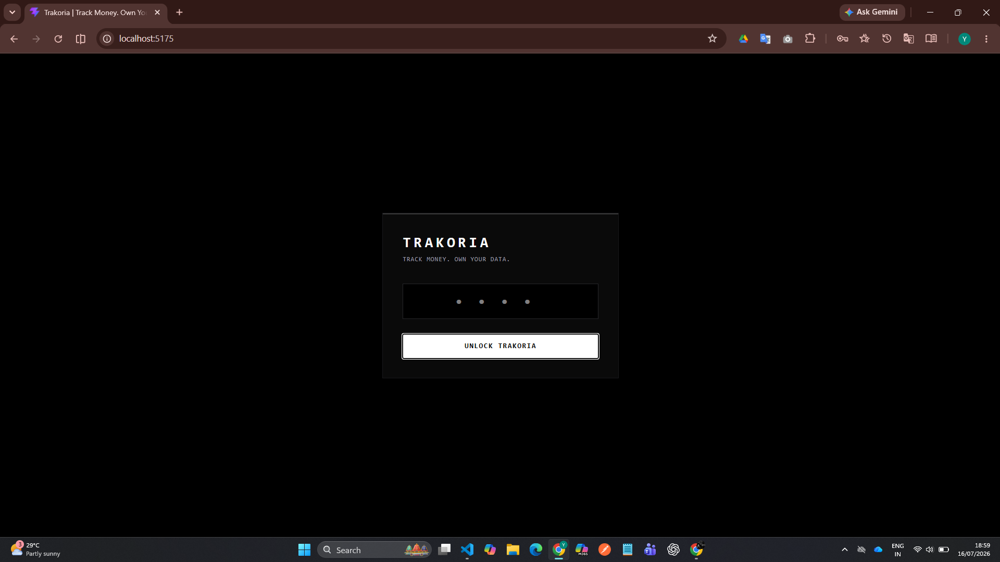
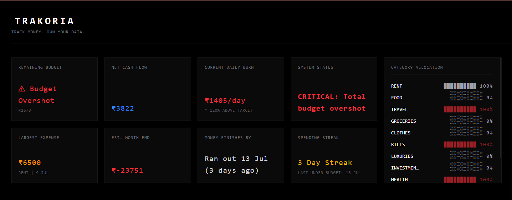
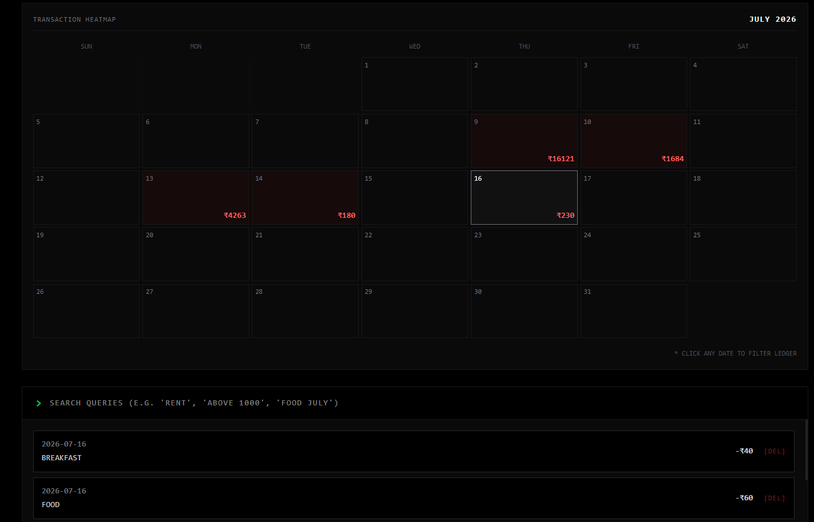
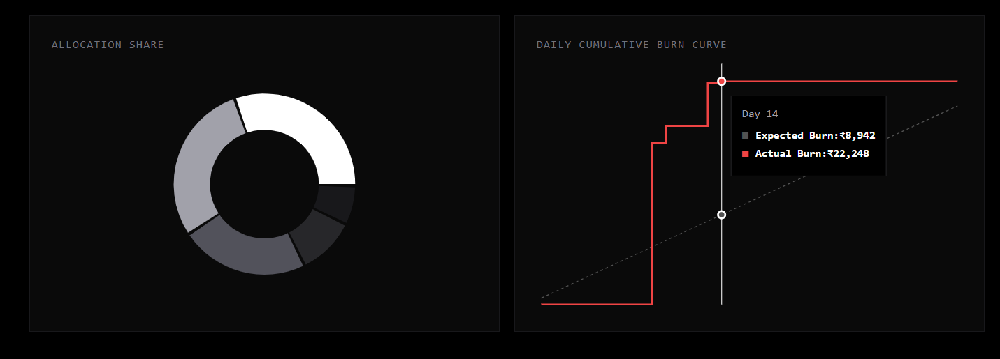
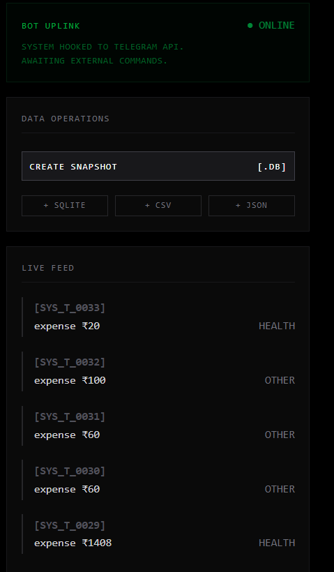

<div align="center">

# Trakoria

### **Track Money. Own Your Data.**

**Privacy First • Offline First • Local Storage • Terminal Inspired**


A modern, offline-first personal finance workspace built with **React**, **FastAPI**, and **SQLite**.

No cloud.  
No subscriptions.  
No data collection.

**Everything stays on your machine.**



</div>

---

## Features

- PIN Protected Authentication
- Terminal Inspired Interface
- Interactive Financial Dashboard
- Daily Burn Rate Analytics
- Spending Calendar Heatmap
- Category Allocation Charts
- Budget Tracking
- Spending Streak Tracking
- Transaction Timeline
- Telegram Expense Logging
- SQLite Database
- CSV Export
- JSON Export
- SQLite Snapshot Backup
- FastAPI REST API
- Fully Offline
- Privacy First Architecture

---

## Preview

### Secure Lock Screen

<p align="center">

</p>

---

### Dashboard

<p align="center">

</p>

---

### Calendar Heatmap

<p align="center">

</p>

---

### Analytics

<p align="center">

</p>

---

### Data Operations

<p align="center">

</p>

---

## Demo

A quick walkthrough of Trakoria.

📹 **Demo Video**

[▶ Watch Demo](demo/demo.mp4)

---

## Architecture

```text
                React + Vite
                     │
                     ▼
              FastAPI Backend
                     │
                     ▼
               SQLite Database
                     ▲
                     │
          Telegram Expense Bot
```

---

## Tech Stack

| Layer | Technology |
|--------|------------|
| Frontend | React.js + Vite |
| Styling | CSS |
| Backend | FastAPI |
| Language | Python |
| Database | SQLite |
| Charts | Recharts |
| Bot | Telegram Bot API |

---

## Project Structure

```text
Trakoria/
│
├── frontend/
│   ├── src/
│   ├── public/
│   ├── package.json
│   └── vite.config.js
│
├── screenshots/
│   ├── dashboard.png
│   ├── lockscreen.png
│   ├── calendar.png
│   ├── analytics.png
│   └── export.png
│
├── demo/
│   └── demo.mp4
│
├── api.py
├── bot.py
├── db.py
├── parser.py
├── export.py
├── config.json
├── README.md
├── .gitignore
├── .env.example
└── requirements.txt
```

---

## Installation

### Clone Repository

```bash
git clone https://github.com/Yash23001-stack/Trakoria.git

cd Trakoria
```

---

### Backend

Install dependencies

```bash
pip install -r requirements.txt
```

Run the backend

```bash
uvicorn api:app --reload
```

---

### Frontend

```bash
cd frontend

npm install

npm run dev
```

---

### Open Application

```
http://localhost:5175
```

---

## Environment Variables

Create a `.env` file in the project root.

```env
BOT_TOKEN=YOUR_TELEGRAM_BOT_TOKEN
APP_PIN=0000
```

---

## Export Support

Trakoria supports:

- CSV Export
- JSON Export
- SQLite Database Snapshot

All exports are generated locally without requiring an internet connection.

---

## Telegram Integration

Log expenses directly from Telegram.

Example:

```text
500 Tea

1200 Petrol

Salary 20000
```

The bot automatically parses each message and stores the transaction in the local SQLite database.

---

## Privacy

Trakoria follows one simple philosophy.

- No Cloud
- No Tracking
- No Analytics
- No Advertisements
- No Subscription
- No Data Collection

Your financial data always remains on **your own machine**.

---

## Why Trakoria?

Most personal finance applications rely on cloud storage and online accounts.

Trakoria takes a different approach.

Instead of storing your financial history on someone else's servers, Trakoria keeps everything on your own device.

Whether you're tracking daily expenses, managing monthly budgets, or reviewing spending habits, your data remains private and fully under your control.

> **Track Money. Own Your Data.**

---

## Author

**Yash Bhandare**

Built with:

- React
- FastAPI
- SQLite
- Python

If you found this project useful, consider giving it a ⭐ on GitHub.

---

## License

This project is licensed under the MIT License.